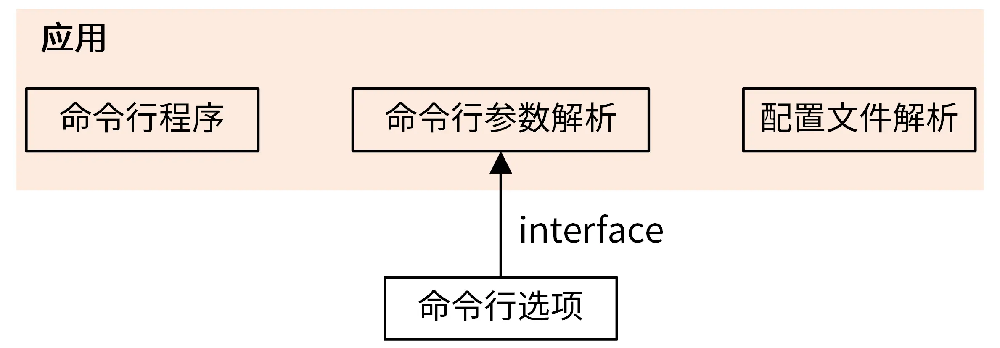

app 目录下的 5 个主要文件是
- app.go
  - 应用
- cmd.go
  - 命令行程序
- config.go
  - 命令行参数解析
- flag.go
  - 配置文件解析
- options.go
  - 命令行选项

应用由
1. 命令行程序
2. 命令行参数解析
3. 配置文件解析
三部分组成，命令行参数解析 功能通过 命令行选项 来构建，二者通过接口解耦合,应用由命令行程序、命令行参数解析、配置文件解析三部分组成，命令行参数解析功能通过命令行选项来构建，二者通过接口解耦合：
通过接口，应用可以 定制 自己独有的命令行参数